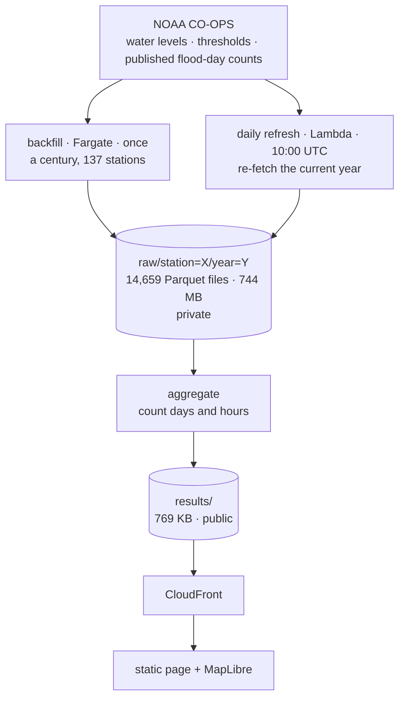

# Coastal Flood Days

**NOAA publishes how many *days* each US coastal gauge floods. It doesn't publish how long
the water stays up. This does.**

🌊 **[floodhours.ajithmanmadhan.com](https://floodhours.ajithmanmadhan.com)**

A flood day is a binary: one day whose water level crossed the local threshold. But across
these 137 gauges, one flood day means anything from just over an hour above the line to most
of a day — and NOAA's published counts score every one of them the same. This computes the
hours, for every station-year on record, and publishes the result as a dataset.

## The finding

Coastal floods come far more often than they used to. **They don't last any longer.**

- Flood days rose at **73 of 86** gauges with records long enough to compare their first and
  last decade.
- Over the same spans, the typical flood ran **1.95 hours** in a gauge's first decade and
  **1.97 hours** in its last — a median across the 41 longest records.

More floods, the same shape. How long a flood lasts turns out to be a property of *place*,
not of time: one flood day means about an hour at Monterey and about nine and a half at
Rockport, TX — set by tidal regime and basin geometry, and barely moving across a century at
any one station. NOAA's published counts score both as "one flood day".

The site shows this rather than asserting it: a slope chart draws all 86 long-record stations,
each a line from its first decade of record to its most recent, so the 73 rising and 13 flat
are visible at a glance.

**This is not new science.** The metric is standard in the literature and the geographic
pattern is already published. NOAA's
[Inundation Analysis Tool](https://tidesandcurrents.noaa.gov/inundationanalysis/) computes
duration for one station over a limited date range, and there is a
[public notebook](https://github.com/NOAA-CO-OPS/Coastal_Hazards_Example_Notebooks) that does
something similar. The contribution here is the **bulk record** — duration made comparable
across thousands of station-years alongside the published day counts — plus the pipeline that
produces it.

## The dataset

| | |
|---|---|
| Gauges | **137** |
| Station-years | **7,743** computed · **6,848** usable (≥90% complete) |
| Hourly readings | **59.5 million**, counted individually |
| Span | **1920–2026** |
| Longest record | The Battery, NY — 91 usable years, 1921–2025 |

Computed from raw hourly water-level observations, not from NOAA's published counts.

**Artifacts** (all behind the same CloudFront distribution):

| Path | What |
|---|---|
| `results/flood_days.parquet` | the dataset — every station-year, nothing hidden |
| `results/map_summary.json` | ~137 station rows, the headline figures, and the then-vs-now trajectories — everything the page needs on first paint |
| `results/stations/{id}.json` | one station's full annual record |
| `results/last_updated.json` | when the daily refresh last published, and what failed |

## Validation

Flood-day counts are computed independently from hourly observations, then checked against
NOAA's own published `htf_annual` counts for the same station-years:

| | |
|---|---|
| Exact match | **6,557 / 6,848 — 95.75%** |
| Within 1 day | **6,821 / 6,848 — 99.61%** |
| Within 2 days | 99.87% |
| Worst disagreement | 3 days |

Two of those decisions were settled by measurement rather than documentation, and both
changed the answer:

- **GMT day boundaries, not local standard time.** Counting on LST days disagreed with NOAA
  by 9 days across 9 stations in 2024; GMT disagreed by 1. The cost is that a "flood day"
  boundary falls at 7–8pm local on the East Coast, which is not the day anyone lived through.
  Kept deliberately, because comparability with NOAA is worth more than intuitive boundaries.
- **`>=`, not `>`.** NOAA's published wording is "exceeds", which reads as strictly greater.
  Their data disagrees. Where the docs and the data conflict, follow the data and say so.

## Architecture




**Two pipelines, not one.** The backfill walks a century of history once and caches it. The
daily job refetches the *current year* for every station — not a trailing window — because
NOAA revises recent observations for weeks, and `hourly_height` returns up to a year per
request. A whole year costs the same one call as a single day, so the guess about how far
back to look disappears entirely.

**The map basemap is a 382 MB PMTiles archive in the same bucket**, extracted from Protomaps'
137 GB planet build and read by HTTP range request — the browser pulls a directory from the
front of the file, then only the bytes for the tiles on screen. Same pattern as a GRIB2
`.idx` sidecar or a Kerchunk reference file: one immutable blob in object storage plus an
index that turns a logical request into a byte range. No tile server, no API key.

**Everything is one origin.** Page, data, libraries and basemap all sit behind one
distribution, so there is no CORS. The single exception is a deferred, cookieless analytics
script; every call into it no-ops when it is absent, so a reader who blocks trackers gets
the identical page.

## Methodology

The rules that decide what counts, in `src/flood_days.py`:

1. **Daily maximum, binary count.** A day with two exceeding high tides counts once.
2. **Station-specific NOS thresholds**, fetched from NOAA. Never invented.
3. **Never MHHW as the threshold** — that's the average high tide, exceeded about half the
   days of the year by definition.
4. **One timezone throughout** — GMT, established by measurement (see above).
5. **Completeness filter.** A year under 90% valid observations is excluded, not reported as
   a calm year. An absent year is *unknown*, not flood-free.
6. **Fixed vertical reference.** Thresholds come back in feet above station datum, so water
   levels are requested in the same frame — `STND` / `english`. Mixing datums here is a ~6 ft
   error that produces plausible-looking output.
7. **Relative sea level ≠ ocean rise.** Claim the flooding, not the cause.
8. **37 years minimum for any trend claim** — two full 18.6-year lunar nodal cycles, or the
   cycle itself can masquerade as a trend.
9. **Hourly data is a valid proxy for cumulative hours**, accurate to 3–5% for an annual
   total — but it says nothing about how long any individual flood lasted. A 40-minute event
   is invisible at this resolution.
10. **"Exposure duration", never "impact duration."** These are hours at or above a threshold
    *at the gauge*. Not road closures, not property damage, not street flooding — and tide
    gauges systematically undercount the latter.
11. **Never render a value where nothing was measured.** The map is points, not surfaces. A
    coastline ribbon shading between gauges was built and deleted: neighbouring gauges agree
    on flood length to ~15% within 50 km and diverge past it, so at the density NOAA operates
    gauges there is no radius at which painting between them is honest.

**Known caveats, stated rather than buried.** Some gauges are river-influenced — Berwick, on
the Atchafalaya, reports 22 hrs per flood day and is flagged in the scatter rather than
quietly dropped. Headline ranges use the 10th–90th percentile so a single outlier can't set
them.

## Running it

```bash
python3 -m venv .venv
.venv/bin/pip install -r requirements.txt
.venv/bin/python tests/test_count_flood_days.py     # 6 tests, no network

python3 serve.py                                     # http://localhost:8899
```

`serve.py` implements HTTP Range. `python -m http.server` ignores the `Range` header and
answers 200 with the whole body, which would hand MapLibre the entire 382 MB archive per tile
and look fine locally while being nothing like production.

Local development needs the basemap archive, which is not in the repo:

```bash
brew install pmtiles
pmtiles extract https://build.protomaps.com/YYYYMMDD.pmtiles \
  web/basemap/protomaps-YYYYMMDD.pmtiles \
  --region=basemap/region.geojson --maxzoom=10
```

`basemap/region.geojson` is the area of interest: 8 non-overlapping boxes covering the
mainland and the island clusters. They must stay disjoint — every extract carries the same
world-spanning z0–z2 tiles, so merging per-region extracts always collides at 0/0/0.

## Deploying

Push to `main` touching `web/`, `deploy.sh` or the workflow, and GitHub Actions publishes the
page. No AWS keys are stored: the workflow assumes a role via OIDC, scoped to `index.html`
and `vendor/*` only. It cannot write `results/` (the daily Lambda owns that) or read `raw/`.

Every deploy re-runs the check that matters:

```
raw/ -> 403
```

A wildcard in the bucket policy once made the entire 736 MB raw archive publicly downloadable
through CloudFront while direct S3 access was correctly denied — so every positive test still
passed. The only assertion that would have caught it is the one about what is *not* reachable.

> ⚠️ **Ordering.** The page and the pipeline are coupled through `map_summary.json`: the two
> lead figures are written by `aggregate.py`, which runs inside the daily Lambda. Changing
> them means rebuilding and pushing the Lambda image *before or with* the page, or the block
> disappears on the next daily run. The page falls back to figures it can derive from the
> station list, so this degrades rather than breaks — but nothing enforces the ordering.

**Monitoring is deliberately thin.** One alarm, on the job not running for 25 hours — a
pipeline that silently stops is the failure this is most likely to have. There is no alarm
on error counts; a run that fails outright is caught by `results/last_updated.json`, which
carries the last successful publish time and the stations that failed, and by the
refuse-to-publish guards, which leave the previous data live rather than replacing it with
something worse.

Infrastructure is Terraform in `infra/`. **State is local and gitignored** — one laptop
failure from unrecoverable. Moving it to an S3 backend is outstanding.

## Layout

```
src/flood_days.py       counting rules — thresholds, day boundaries, the event definition
src/storage.py          cache layer, local or S3, keyed station=X/year=Y
src/backfill.py         one-off history walk, with a kill switch and six other brakes
src/daily.py            daily refresh + Lambda handler
src/aggregate.py        builds the published artifacts and the headline figures
src/station_history.py  one station's full record
web/index.html          the page — MapLibre map, scatter, table, station detail
infra/                  Terraform: S3, CloudFront, ECS, Lambda, EventBridge, alarms, OIDC
basemap/region.geojson  area of interest for the basemap extract
serve.py                local dev server with Range support
```

## Data source

All observations from [NOAA CO-OPS](https://tidesandcurrents.noaa.gov/). Basemap ©
[OpenStreetMap](https://www.openstreetmap.org/copyright) contributors, via
[Protomaps](https://protomaps.com/).
