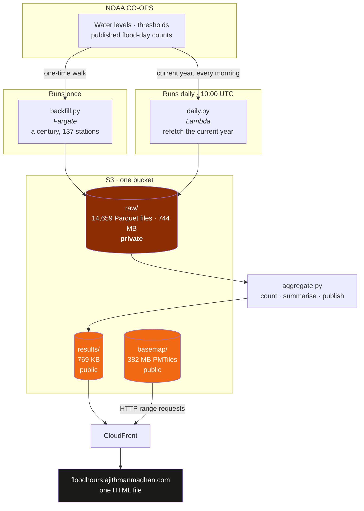
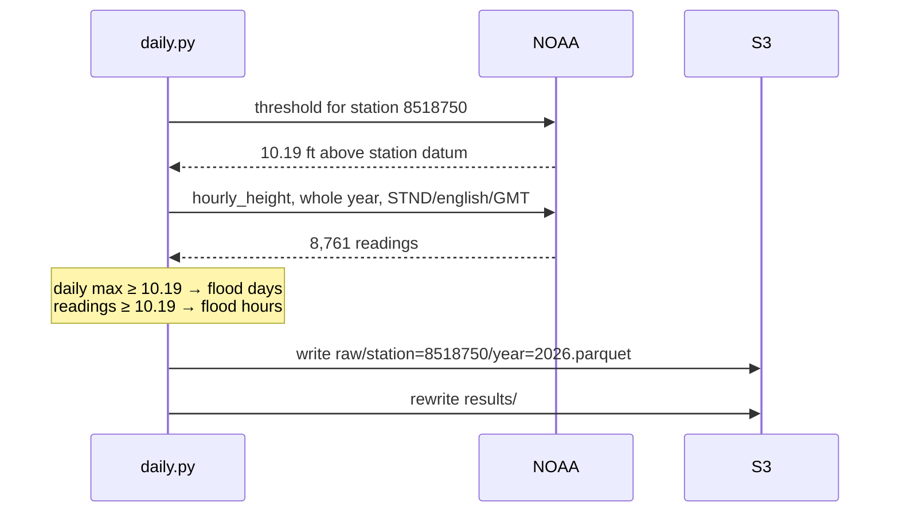
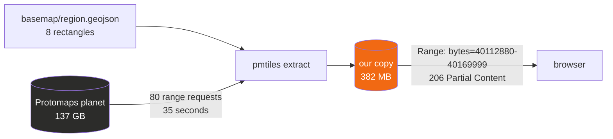
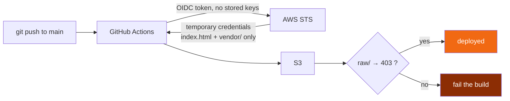

# Architecture

Mermaid source for the project's diagrams. These render on GitHub and in Obsidian.

**dev.to does not render Mermaid** — its editor supports dozens of embeds and KaTeX, but no
diagram syntax. The two diagrams used in the blog post are therefore checked in as PNGs
alongside their `.mmd` source:

    blog/diagram-pipeline.png   +  diagram-pipeline.mmd
    blog/diagram-basemap.png    +  diagram-basemap.mmd

Regenerate with:

```bash
npx @mermaid-js/mermaid-cli -i blog/diagram-pipeline.mmd -o blog/diagram-pipeline.png \
  -c blog/mermaid-theme.json -b "#0d0d0d" -w 1400 --scale 2
```

## The whole system



**The split that matters:** the century is fetched once and kept. Everything after that
recomputes from the cache, so a change to a counting rule costs nothing at NOAA.

## What one station-year costs



Two calls per station. A whole year costs the same single request as one day, which is why
the job refetches the year rather than guessing how far back NOAA's revisions reach.

## The basemap, and why it is one file



The planet file is never downloaded — not when cutting our copy, and not by any reader. Both
steps read an index and ask for byte ranges.

## Publishing



The deploy role can write the page and its assets and nothing else. It cannot touch
`results/`, which belongs to the daily Lambda, and it cannot read `raw/` at all.

Every deploy asserts the negative case: the raw archive must return 403. A wildcard in the
bucket policy once made all 744 MB publicly downloadable while every positive test still
passed.
