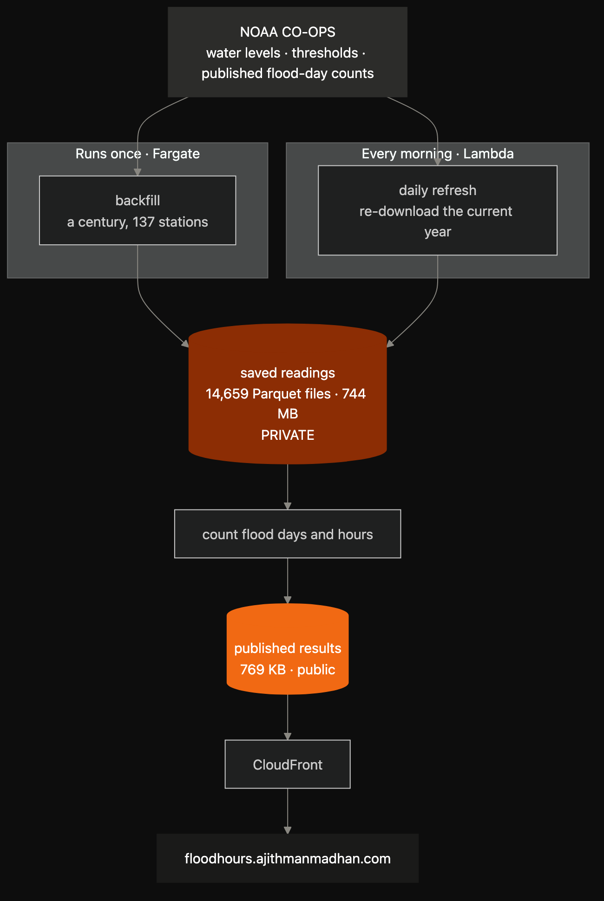
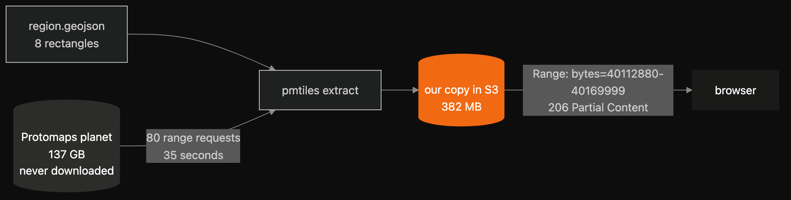
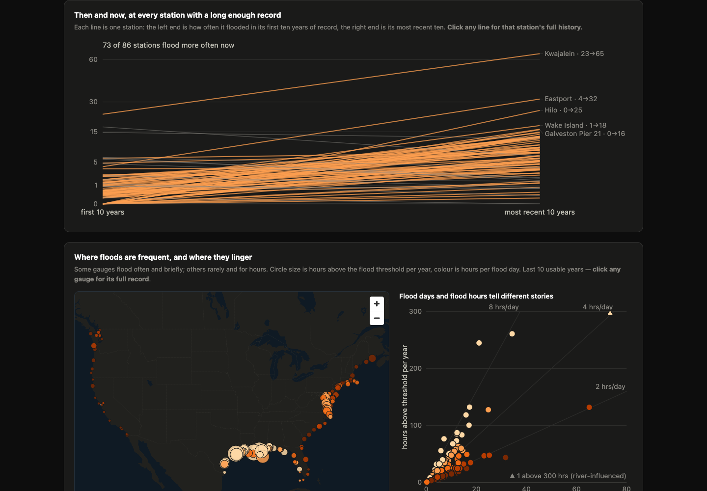
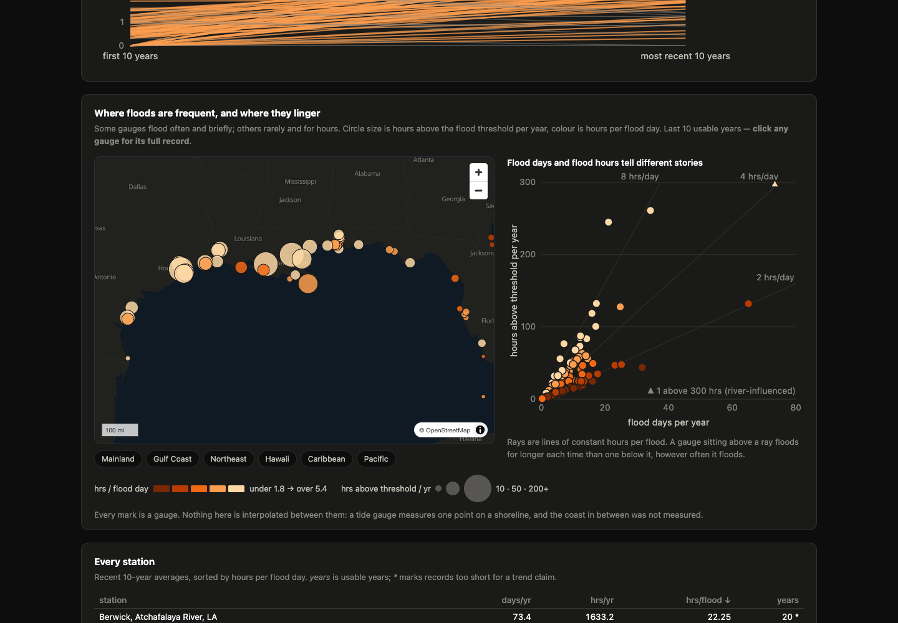

Boston and Galveston flood about the same number of days a year. Thirteen and sixteen.

Their flood days are nothing alike. A flood in Boston lasts about ninety minutes. A flood in Galveston lasts about seven and a half hours.

The published counts score them the same.

A flood day is a binary: did the water cross the local threshold at any point? Water that drains inside an hour and water sitting over a road for most of a working day come out identical. NOAA has kept those counts for 137 US tide gauges for a century. The duration behind them has never been published as a dataset.

So I computed it. 137 gauges, 7,743 station-years, 59.5 million hourly readings, 1920 to today. It's live at [floodhours.ajithmanmadhan.com](https://floodhours.ajithmanmadhan.com), and the Parquet file carries every station-year: flood days, flood hours, and how long a typical flood lasted at that station.

**Stack:** Python (pandas, requests), AWS Fargate for the one-time backfill, Lambda + EventBridge for the daily refresh, S3, CloudFront, Terraform, MapLibre GL, PMTiles.

## What The Data Says

**Floods got much more frequent.** Of the 86 gauges with records long enough to compare their first decade against their most recent, 73 flood more often now. Galveston went from 0.7 flood days a year across 1920–1999 to 15.9 in the last ten.

**They didn't get longer.** Across the 41 longest records, the typical flood ran 1.95 hours in a gauge's first decade and 1.97 hours in its last. That's a century apart. Galveston's floods were 8.2 hours each back then and 7.5 hours now.

More floods. Same shape. I expected the second number to climb with the first and it doesn't move at all. How long a flood lasts is set by tidal regime and basin geometry, which is a fact about the place rather than about the year.

## What The Pipeline Looks Like

NOAA holds a century of hourly water levels and I need all of them. I'd rather ask once.

So the first job downloads everything: 137 stations, every year back to 1920, saved into S3 as one Parquet file per station-year. It ran once on Fargate and hasn't had to run since. It also has a stop button, a flag in SSM that the job checks between stations, because a script that hammers someone else's free API for hours is one you want to be able to halt without killing the container mid-write.

The second job runs every morning on Lambda. It downloads the current year again for all 137 stations, because NOAA keeps revising recent readings for weeks after first publishing them. I could fetch just the last few days instead, but then I'm guessing how far back the corrections reach. A whole year is one API call, the same as a single day, so I take the year and the guess goes away.

Counting is a separate step that reads those saved files rather than calling NOAA. So changing how a flood day is defined means recounting 59.5 million readings locally, with no requests to their servers at all.

The saved readings stay private in S3. Only the counted results are public.



## Checking The Count Against NOAA

First, where the line comes from. Every station has its own flood threshold, published by NOAA — 10.19 feet at The Battery, measured from that station's own zero mark on the pier. Not sea level, not a national figure. The water levels have to be requested in the same reference frame as the threshold, or you're comparing heights measured from two different starting points, which is a six-foot error that still produces perfectly plausible output.

NOAA also publishes its own flood-day counts, so I could check mine against theirs. Two things came out wrong at first:

- **Day boundaries.** I used local time. NOAA uses GMT. Switching cut my disagreement from 9 days to 1.
- **The comparison.** NOAA's docs say the water must *"exceed"* the threshold, which reads as `>`. Their numbers behave as `>=` — water sitting exactly on the line counts as a flood.

That second one cost me an afternoon. I changed the operator first, saw no improvement, and decided it wasn't the problem. It was. The timezone was wrong too and was hiding it, and I only found both by testing all four combinations at once.

Across 6,848 station-years my counts now match NOAA's exactly **95.75%** of the time, and within one day **99.61%**.

## The 137 GB File I Never Downloaded

The site needs a map. The usual answer is Mapbox or Google, which means an API key, a bill that grows with traffic, and one more service that has to be up for your page to work.

None of that felt right for a page showing a coastline. Coastlines don't move.

PMTiles is the alternative. A map gets chopped into thousands of small tiles, and all of them are packed into a single file with an index at the front recording where each tile sits and how long it is. Protomaps publishes the entire planet in that format every day. It's 137 GB.

You never download it. You read the index over the network, work out which tiles you want, and ask for those byte ranges:

```bash
pmtiles extract https://build.protomaps.com/20260820.pmtiles \
  web/basemap/protomaps-20260820.pmtiles \
  --region=basemap/region.geojson --maxzoom=10
```

`region.geojson` is eight rectangles: one around the mainland US, seven around Hawaii, Puerto Rico, Guam, Wake, Kwajalein, Midway and Samoa. Everything outside them is skipped.

**382 MB out of 137 GB. Eighty HTTP requests. Thirty-five seconds.**

The browser then does the same thing against my copy in S3. It reads the index, works out which tiles are on screen, and asks for exactly those bytes:

```
Range: bytes=40112880-40169999
→ 206 Partial Content
```

A client asks for a byte range, S3 streams back that slice and answers `206 Partial Content` instead of `200`. It's been part of HTTP since the nineties — the same mechanism behind resuming a paused download — and neither S3 nor CloudFront needs anything switched on. So nobody downloads 382 MB. They pull a few kilobytes for whatever is on screen.

The pattern is bigger than maps. Weather data uses it: a GRIB2 file holds hundreds of forecast layers, and a small `.idx` file next to it lists the byte offset of each one, so you can pull the layer you want without reading the rest. A tool called Kerchunk does the same for scientific archives, building an index over files that were never designed to be read this way.

The shape is always the same. One large file that doesn't change, an index describing what's inside it, and byte ranges that turn it into something you query rather than something you download.



Storage cost for the basemap: about a cent a month.

## What The Site Shows

Three views of the same data.



The slope chart is the one I'd point at. Each line is a station, left end its first ten years of record, right end its most recent. 73 rise, 13 stay flat. That's the claim from the top of this post, drawn rather than asserted.



The map is where and the scatter is how the two numbers relate: across is how often a station floods, up is total hours a year. High and left means rare but long. Low and right means often but brief. Clicking anything opens that station's full century underneath.

There is no API and no database. The daily job precomputes everything into static files, so the site is one HTML page reading JSON from the same bucket. Nothing runs at request time.

## Gotchas

**NOAA started blocking us mid-project.** On a Wednesday the daily job ran fine at 10:04 UTC and every request failed by 13:45. NOAA had begun rejecting default client User-Agents on their metadata endpoint. Nothing in my code had changed.

It hid in two disguises. My own call raised a clean 403. But `noaa_coops`, the library I use for water levels, raised `KeyError: 'stations'` — it builds requests with the bare `requests` module, sets no headers, then indexes the error body as though it were data. An HTTP block surfaced as a missing dictionary key. Fixing my own call left the library still broken, which cost me a second rebuild.

Neither the block nor the disguise is documented anywhere obvious.

**Retrying made the failure mode worse.** I added backoff, which is right, and immediately created a new problem: 137 stations each burning three attempts against a dead endpoint overran the Lambda's ceiling and died as a timeout instead of a clean failure. It now stops after 8 consecutive failures, because one shared upstream problem doesn't need proving 137 times.

**The guard that mattered.** Through both broken runs the published dataset was never touched. `daily.py` refuses to publish if too few stations refreshed, so a failed run leaves yesterday's data live rather than replacing 137 stations with nothing. That check was written months earlier for exactly this and it earned its place in an afternoon.

## The Security Bug Every Test Passed

That private raw archive was not private for a while.

The bucket policy granted CloudFront `s3:GetObject` on `/*`. Direct S3 access was correctly denied. Every check I ran came back green.

The 744 MB raw archive was publicly downloadable through the CDN by anyone who guessed a key.

I found it by testing the negative case instead of the positive one. The policy now enumerates exactly the paths the page needs, and every deploy asserts it:

```
raw/ -> 403
```

If that ever returns 200, the build fails. The only assertion that would have caught the original bug is the one about what *isn't* reachable.

## What I'd Tell You To Take From This

- **Test the negative case.** "Is the site up" passes whether or not your private data is exposed. Assert what should be unreachable, on every deploy.
- **Where the docs and the data disagree, follow the data.** NOAA says "exceeds"; NOAA's numbers say `>=`. Test it, pick the one that matches, and state the choice in your methods.
- **Change one variable at a time, or run the whole matrix.** I changed the operator alone, saw no improvement, and drew the wrong conclusion because a second variable was masking it.
- **Byte ranges turn big files into queries.** A 137 GB archive you can read 16 bytes out of is a different kind of object than a 137 GB file you have to download. Same trick as `.idx` and Kerchunk.
- **Guard the publish step, not just the fetch.** Two runs failed completely and the live dataset never wobbled, because the job refuses to publish a mostly-empty refresh.

## Is It Worth Building?

For the dataset, yes. Duration made comparable across thousands of station-years didn't exist in queryable form, and now it does. The science isn't new — the metric is standard and the geographic pattern is published — but the artifact wasn't there.

For the engineering, the parts I'd reuse tomorrow are the byte-range basemap and the refuse-to-publish guard. Both are small, both solved a real problem, and neither took long.

Code, methods and the full dataset: [github.com/ajithmanmu/coastal-flood-days](https://github.com/ajithmanmu/coastal-flood-days)

*Ajith builds data infrastructure for large-scale scientific and geospatial data.*
